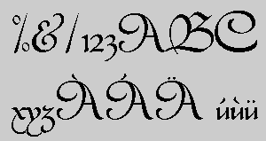

# Civitype



The original version of this typeface was drawn by Robert Granjon (active
in the latter half of the 16th century---he also designed a number of
typographic ornaments that have become standard in typography). It is a
typographic rendering of the gothic hand 'batarde'. This version is based
on Louis Ferrand's ATF version of Civilite. There are also versions by
Deberny et Peignot, and Enschede (both with a much more gothic character to
them). Variations on this typeface include Ilse Schuele's 'Rhapsody', and
Schneidler's 'Legend'. Morris Benton designed Typo Upright (also called
Linoscript) which is based on the later development of Civilite.

The type is best used in sizes 18-60pt (the original on which this working
is based is 48pt).

Font Formats:
- Adobe (Type 1 [pfa & pfb], Type 3, Bitmap)
- DMF (+ bitmap)
- Bitmap (Black&White)
- IntelliFont
- Truetype

Font ID:      15957

Directory:    Script/Civitype

This font is Public Domain. Copyright 1991 by S. G. Moye. Additional 
characters by Danny Amor. You can copy this font with the readme files only!

```
Stephen Moye (CIS 76416,1542)
The Studio
Dept. 158
306 Thayer St.
Providence, Rhode Island
USA
```
